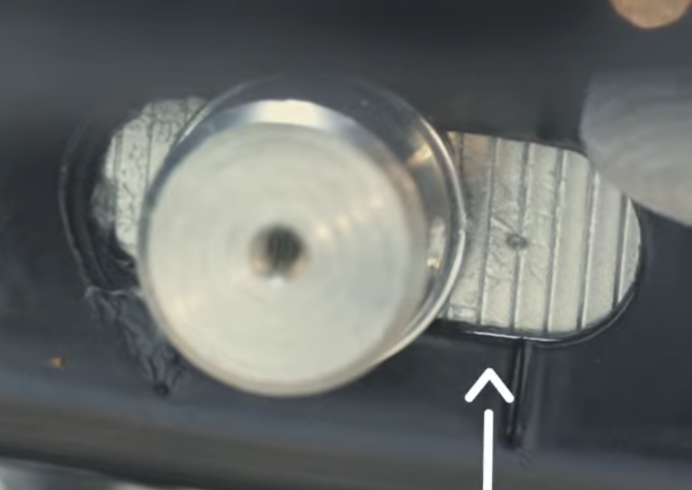

---
tags:
  - classic-350-reborn
  - обслуживание
aliases:
  - rear wheel removal
---

# Снятие заднего колеса

## Требуемые инструменты

- Г-образный шестигранник на 6 мм. 
- Накидной гаечный ключ на 24 мм. ^a6b574
- [[../Инструменты/Удлинительная трубка|Удлинитель]].
- [[../Инструменты/Крестовая отвёртка|Крестовая отвёртка]].
- Киянка/молоток.

## Ограничения

1. Дать глушителю остыть перед выполнением операции.
2. Не класть колесо тормозным диском вниз.
3. Не использовать задний тормоз после [[#^205644|шага6]].

## Порядок действий

Стороны ниже указаны, если смотреть на мотоцикл сзади.

1. Поставить мотоцикл на центральную подножку на ровную и плоскую поверхность.
2. Запомнить расположение маркеров рядом с обеих сторон задней оси:
   

   
   
   

3. Вставив [[../Инструменты/Крестовая отвёртка|отвёртку]] в шпиндель на левой стороне, использовать [[#^a6b574|ключ на 24 мм]], чтобы открутить гайку шпинделя:
   ![[attachments/Pasted image 20260211233851.png]]
4. Наполовину вытащить шпиндель с левой стороны, не вынимая отвёртку.
5. Убрать тормозной провод и кабель АБС из фиксаторов:
   ![[attachments/Pasted image 20260211234122.png]]
6. Вытащить узел с суппортом и положить на глушитель, предварительно накрыв его тряпкой:
   ![[attachments/Screenshot_2026-02-11_000145.png]] ^205644
7. Вставить картонку/аналог между суппортами.
8. Придерживая колесо, вытащить шпиндель с левой стороны до конца.
9. Вытащить натяжители цепи с обеих сторон маятника:
   ![[attachments/Screenshot_2026-02-11_000146.png]]
10. Вытащить проставку с левой стороны звезды:
   ![[attachments/Screenshot_2026-02-11_000147.png]]
11. Вытащить звезду вместе с цепью, отсоединить цепь и положить звезду на чистую поверхность:
    ![[attachments/Screenshot_2026-02-11_000148.png]]
    Не потерять проставку с правой стороны звезды.
12. Взявшись за руль и заднюю ручку сиденья с левой стороны, немного наклонить мотоцикл, стоящий на центральной подножке, и вытащить заднее колесо:
    ![[attachments/Screenshot_2026-02-11_000149.png]]
13. Убедиться и внимательно следить, что проставка в центре колеса с правой стороны не потеряна.

Для установки колеса повторить шаги, противоположные шагам 3-12, в обратном порядке. Перед вставкой шпинделя нанести на него смазку. После закрутки гайки шпинделя проверить, что колесо вращается на оси свободно.

Отрегулировать степень натяжения цепи, для чего выставить изначальное расположение маркеров с помощью натяжителей. Подробнее в [[Регулировка цепи|регулировке цепи]].

Степень закрутки болтов можно найти в [[../owners-manual-re-classic-350-reborn.pdf|мануале]]:
- Для гайки шпинделя (24 мм): 63-77 Нм.
- Для шестигранника (6 мм): 21-29 Нм.

---

[All New Classic 350 DIY | REAR WHEEL REMOVAL](https://www.youtube.com/watch?v=7WJ10qLqQYE&list=PLT1BEDU54E1QNhNm0RBd0BGXzAH1leldc&index=28).